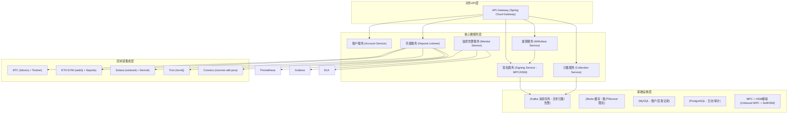

```mermaid
graph TD
    subgraph 对外API层
        Gateway["API Gateway (Spring Cloud Gateway)"]
    end

    subgraph 核心微服务层
        Account["账户服务 (Account Service)"]
        Deposit["充值服务 (Deposit Listener)"]
        Withdraw["提现服务 (Withdraw Service)"]
        Sign["签名服务 (Signing Service - MPC/HSM)"]
        Collection["归集服务 (Collection Service)"]
        Monitor["监控告警服务 (Monitor Service)"]
    end

    subgraph 区块链集成层
        BTC["BTC (bitcoinj + Testnet)"]
        ETH["ETH EVM (web3j + Sepolia)"]
        SOL["Solana (solana4j + Devnet)"]
        TRON["Tron (tron4j)"]
        COSMOS["Cosmos (cosmos-sdk-java)"]
    end

    subgraph 基础设施层
        Kafka["(Kafka 消息队列 - 异步归集/告警)"]
        Redis["(Redis 缓存 - 账户/Nonce/限流)"]
        MySQL["(MySQL - 账户/交易记录)"]
        PG["(PostgreSQL - 日志/审计)"]
        HSM["MPC + HSM模拟 (Unbound MPC + SoftHSM)"]
    end

    Gateway --> Account & Deposit & Withdraw & Sign & Collection
    Deposit --> BTC & ETH & SOL & TRON & COSMOS
    Withdraw --> Sign --> Kafka
    Collection --> Kafka
    Monitor --> Prometheus & Grafana & ELK
```